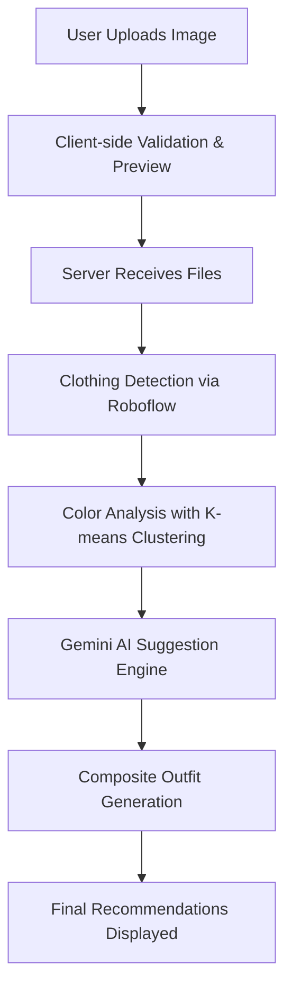

<div align="center">
  <h1>DRIP CHECK</h1>
  <p><i>Personalized outfit recommendations powered by Roboflow model + Gemini AI</i></p>
  
</div>

---

## 🧩 Overview

> Imagine a tool that helps you turn simple wardrobe photos into styled, confidence-boosting outfit ideas — instantly.

**DRIP CHECK** does just that.  
Whether you're planning a look for an event or simply organizing your wardrobe, this platform blends modern web design, computer vision, and AI to deliver personalized fashion recommendations in real time.


---

## ✨ Features


### 1. 🎨 User Interface System
- Drag-and-drop upload zone with animation
- Image validation + thumbnail previews
- Form input checks & field sanitization
- Loading animations, error messages, and success states

### 2. 🖼 Image Processing Pipeline
- Client-side: FileReader API previews
- Server-side: secure Flask file handling, metadata extraction, and temp file cleanup

### 3. 👗 Clothing Analysis System
- Roboflow API for:
  - Bounding box generation
  - Clothing classification
  - Confidence-based filtering
- Color analysis:
  - Background removal (adaptive thresholding)
  - HSV conversion
  - K-means clustering → HEX color generation

### 4. 🧠 AI Suggestion Engine
- Gemini AI integration with:
  - Context-aware prompts
  - Structured JSON outputs
  - Personalized recommendations based on body type, style, and context
- Fallback system using rule-based logic

### 5. 🪄 Presentation Layer
- Composite image generation with reasoning text
- Responsive outfit grid
- Clear visual separation & progressive disclosure

### 6. 🗂 Data Management
- Client-side: uploaded image arrays, metadata, current outfit state
- Server-side: upload dir, temp handling, composite caching

### 7. 🔌 API Communication
- RESTful endpoints
- JSON and multipart form handling
- Response validation and graceful errors

### 8. 🛑 Error Handling
- User-friendly client errors
- Retry functionality
- Try-catch blocks server-side with fallback logic

### 9.  Accessibility
- Color contrast & focus indicators
- ARIA labels
- Keyboard navigation

### 10. 🚀 Performance Optimizations
- DOM & memory efficiency
- Event delegation
- Background image processing on server


---

## 🚶 Usage Workflow

```plaintext
1. Upload clothing images via drag-and-drop
2. Fill in profile info (style, body type, occasion)
3. AI analyzes visuals + preferences
4. Suggestions rendered with reasoning & visuals
```

---

## 🏗️ Architecture




---

## 🎥 Demo

<p align="center">
  <a href="https://www.youtube.com/watch?v=LjIaYI_8Rxg" target="_blank">
    
  </a>
</p>

> 🎬 Click the image above to watch the full demo (1:09).

---

## ⚙️ Installation

```bash
# Clone the repo
git clone https://github.com/Ranjit-Singh-Dhunna/Outfit-Recommendation-System.git
cd yourrepo

# Start your server
```

Open your browser at `http://localhost:5002` to get started.


---

## 🔐 Environment Configuration

Before running the app, create a `.env` file in the project root to securely store your API keys and workspace/project details.

```env
# .env

# Roboflow API Credentials
ROBOFLOW_API_KEY=your_roboflow_api_key_here
ROBOFLOW_WORKSPACE=your_workspace_name
ROBOFLOW_PROJECT=your_project_name
ROBOFLOW_VERSION=1

# Gemini AI API Key
GEMINI_API_KEY=your_gemini_api_key_here
```
---

## 🤝 Contributing

We welcome contributions! Here's how you can help:

1. Fork the repository
2. Create your feature branch: `git checkout -b feature`
3. Commit your changes: `git commit -m 'Add feature'`
4. Push to the branch: `git push drip feature`
5. Open a Pull Request

---

## ❤️ Acknowledgements

- 🧠 Gemini AI for personalized fashion logic  
- 🤖 Roboflow for robust computer vision detection  
- 🎨 K-means color clustering & HSV color science  
- 🛠 Flask + JavaScript for fast and clean interactions  


---

## 🕒 Last Updated

**July 26, 2025**
